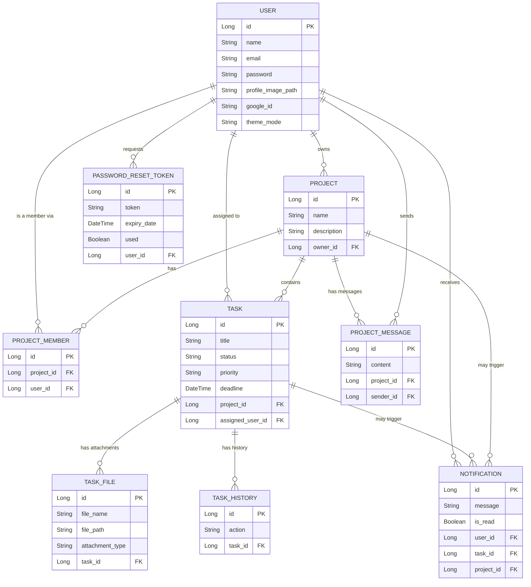
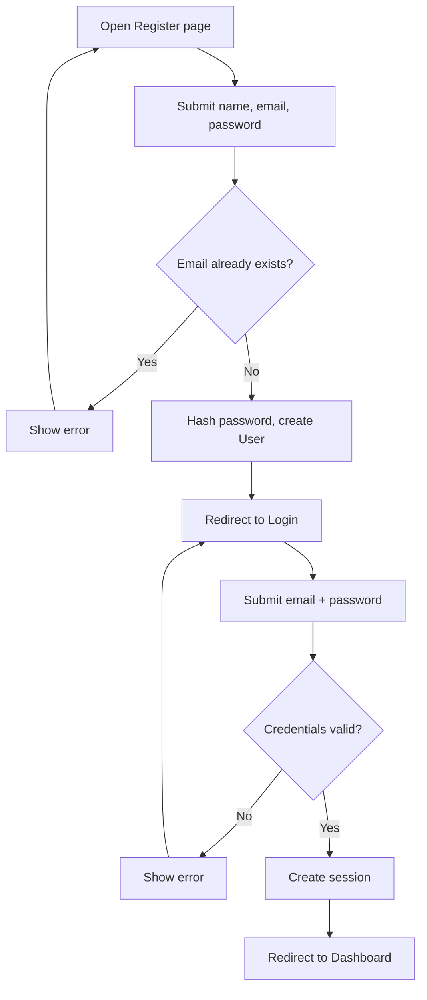
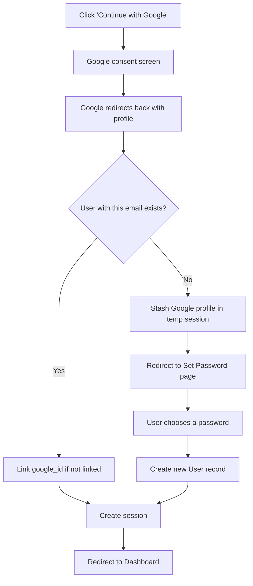
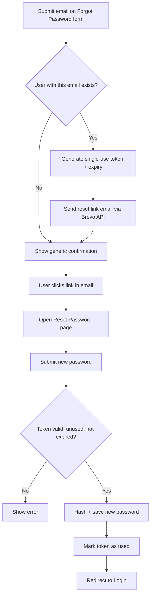
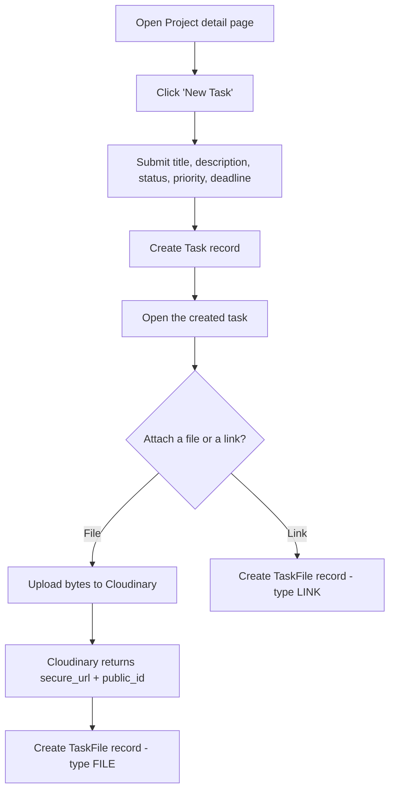
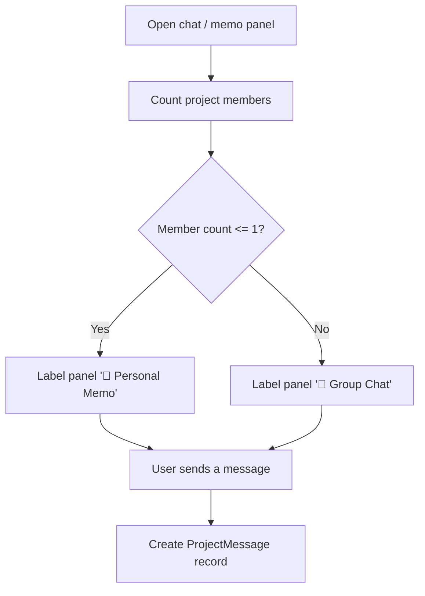
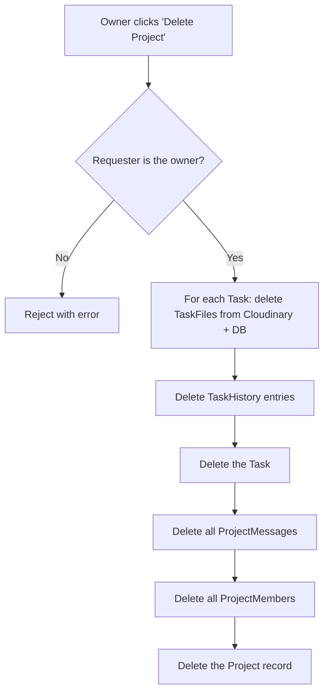
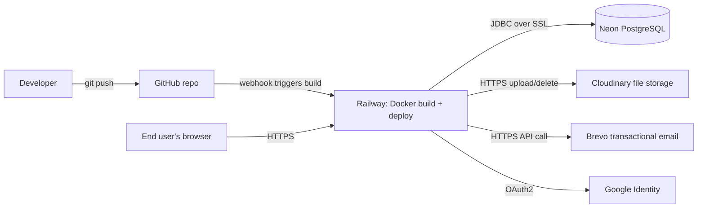

# TaskFlow — Materials for ERD & Flowchart Design

This file lists out the entities, fields, relationships, and process flows of TaskFlow in plain form.

---

## Part 1 — ERD Materials

### 1.1 Entities and fields

**User** (`users`)
| Field | Type | Notes |
|---|---|---|
| id | Long (PK) | auto-generated |
| name | String | required |
| email | String | required, unique |
| password | String | required, BCrypt-hashed |
| profile_image_path | String | Cloudinary secure URL, nullable |
| profile_image_public_id | String | Cloudinary public_id, nullable |
| google_id | String | unique, nullable — only set if the account has ever used "Continue with Google" |
| created_at | DateTime | |
| theme_mode | String | "day" or "night" |

**Project** (`projects`)
| Field | Type | Notes |
|---|---|---|
| id | Long (PK) | |
| name | String | required |
| description | String (TEXT) | |
| owner_id | Long (FK → User) | required |
| created_at | DateTime | |

**ProjectMember** (`project_members`) — join table between User and Project
| Field | Type | Notes |
|---|---|---|
| id | Long (PK) | |
| project_id | Long (FK → Project) | required |
| user_id | Long (FK → User) | required |
| joined_at | DateTime | |

**ProjectMessage** (`project_messages`) — chat/memo entries
| Field | Type | Notes |
|---|---|---|
| id | Long (PK) | |
| project_id | Long (FK → Project) | required |
| sender_id | Long (FK → User) | required |
| content | String (TEXT) | required |
| created_at | DateTime | |

**Task** (`tasks`)
| Field | Type | Notes |
|---|---|---|
| id | Long (PK) | |
| title | String | required |
| description | String (TEXT) | |
| status | Enum | `TODO`, `IN_PROGRESS`, `DONE` |
| priority | Enum | `LOW`, `MEDIUM`, `HIGH` |
| deadline | DateTime | |
| created_at | DateTime | |
| project_id | Long (FK → Project) | required |
| assigned_user_id | Long (FK → User) | nullable |

**TaskFile** (`task_files`) — attachments and links on a task
| Field | Type | Notes |
|---|---|---|
| id | Long (PK) | |
| file_name | String | |
| file_type | String | MIME type, or "LINK" |
| file_path | String | Cloudinary secure URL (for uploaded files) |
| link_url | String | external URL (for LINK-type attachments) |
| attachment_type | String | "FILE" or "LINK" |
| cloudinary_public_id | String | nullable — null for LINK attachments |
| cloudinary_resource_type | String | "image", "raw", "video"; nullable |
| uploaded_at | DateTime | |
| task_id | Long (FK → Task) | required |

**TaskHistory** (`task_history`) — audit trail of task changes
| Field | Type | Notes |
|---|---|---|
| id | Long (PK) | |
| action | String | e.g. "STATUS_CHANGED" |
| old_value | String | |
| new_value | String | |
| changed_at | DateTime | |
| task_id | Long (FK → Task) | required |

**Notification** (`notifications`)
| Field | Type | Notes |
|---|---|---|
| id | Long (PK) | |
| message | String | |
| is_read | Boolean | default false |
| created_at | DateTime | |
| type | String | |
| user_id | Long (FK → User) | required — the recipient |
| task_id | Long (FK → Task) | nullable |
| project_id | Long (FK → Project) | nullable |

**PasswordResetToken** (`password_reset_tokens`)
| Field | Type | Notes |
|---|---|---|
| id | Long (PK) | |
| token | String | required, unique (UUID) |
| user_id | Long (FK → User) | required |
| expiry_date | DateTime | required |
| used | Boolean | required |
| created_at | DateTime | |

### 1.2 Relationships (cardinality)

- **User — Project**: one User (as owner) has many Projects; one Project has exactly one owner. `1 : N`
- **User — Project (via ProjectMember)**: many-to-many. A User can belong to many Projects; a Project can have many Users as members. Realized through the `ProjectMember` join table. `M : N`
- **Project — Task**: one Project has many Tasks; one Task belongs to exactly one Project. `1 : N`
- **User — Task (assignment)**: one User can be assigned to many Tasks; one Task has at most one assigned User (nullable). `1 : N` (optional)
- **Task — TaskFile**: one Task has many TaskFiles (attachments/links); one TaskFile belongs to one Task. `1 : N`
- **Task — TaskHistory**: one Task has many TaskHistory entries; one TaskHistory entry belongs to one Task. `1 : N`
- **Project — ProjectMessage**: one Project has many ProjectMessages (chat/memo); one ProjectMessage belongs to one Project. `1 : N`
- **User — ProjectMessage (sender)**: one User sends many ProjectMessages; one ProjectMessage has exactly one sender. `1 : N`
- **User — Notification**: one User receives many Notifications; one Notification belongs to one User. `1 : N`
- **Task — Notification**: one Task can trigger many Notifications (optional link); nullable FK. `1 : N` (optional)
- **Project — Notification**: one Project can trigger many Notifications (optional link); nullable FK. `1 : N` (optional)
- **User — PasswordResetToken**: one User can have many (historical) PasswordResetTokens; one token belongs to one User. `1 : N`

### 1.3 Mermaid ERD (reference)

---

## Part 2 — Flowchart Materials

### 2.1 Registration & login (email/password)

Steps:
1. User opens Register page → submits name, email, password.
2. System checks if email already exists.
   - If yes → show error, stay on Register page.
   - If no → hash password (BCrypt), create User record, redirect to Login.
3. User submits email + password on Login page.
4. Spring Security validates credentials against the stored hash.
   - If invalid → show error, stay on Login page.
   - If valid → create authenticated session, redirect to Dashboard.

### 2.2 Google OAuth2 login

Steps:
1. User clicks "Continue with Google".
2. Browser redirects to Google's consent screen; user approves.
3. Google redirects back with an authorization code; Spring Security exchanges it for the user's verified profile.
4. `OAuth2LoginSuccessHandler` checks whether a User with that email already exists.
   - If yes → link the Google ID to the existing account (if not already linked) → create session → redirect to Dashboard.
   - If no → clear the half-authenticated OAuth2 session, stash the verified Google profile in a temporary session, redirect to a "Set Password" page.
5. On the "Set Password" page, the user chooses a password → system creates a new User record (with the Google profile's name/email + the chosen password + google_id) → create session → redirect to Dashboard.

### 2.3 Forgot password / reset password

Steps:
1. User submits their email on the "Forgot Password" form.
2. System checks if a User with that email exists.
   - If yes → generate a single-use UUID token with an expiry, save it, send a reset-link email via Brevo's HTTPS API.
   - If no → (for privacy, the UI shows the same generic confirmation either way — no account enumeration).
3. User clicks the link in the email, opening the "Reset Password" page with the token in the URL.
4. User submits a new password.
5. System validates the token: exists, not used, not expired.
   - If invalid/expired/used → show error.
   - If valid → hash and save the new password, mark the token as used, redirect to Login.

### 2.4 Create task + upload attachment

Steps:
1. User opens a Project detail page → clicks "New Task".
2. Submits title, description, status, priority, deadline, optional assigned member.
3. System creates the Task record; a TaskHistory entry may be logged.
4. User opens the task → uploads a file, or adds an external link.
5. If it's a file: the file bytes go directly to Cloudinary; Cloudinary returns a secure URL + public_id; a TaskFile record is created referencing them.
6. If it's a link: a TaskFile record is created with attachment_type = "LINK" and the given URL — no Cloudinary call.

### 2.5 Project chat vs. personal memo

Steps:
1. User opens the chat/memo panel on a Project detail page.
2. System counts the project's members.
   - If member count ≤ 1 (owner only, no other collaborators) → label the panel "📝 Personal Memo", with private-notes framing in the UI text.
   - If member count > 1 → label the panel "💬 Group Chat", with all-members-can-see framing.
3. User sends a message → a ProjectMessage record is created either way; the underlying storage and polling mechanism doesn't distinguish between "chat" and "memo" — the distinction is purely presentational.

### 2.6 Delete project

Steps:
1. Owner clicks "Delete Project" → confirms.
2. System verifies the requester is the project's owner.
   - If not owner → reject with an error.
3. For each Task in the project: delete its TaskFiles (including removing the underlying file from Cloudinary), delete its TaskHistory entries, delete the Task itself.
4. Delete all ProjectMessages belonging to the project.
5. Delete all ProjectMembers belonging to the project.
6. Delete the Project record itself.

### 2.7 High-level deployment flow (for a system/architecture diagram)

